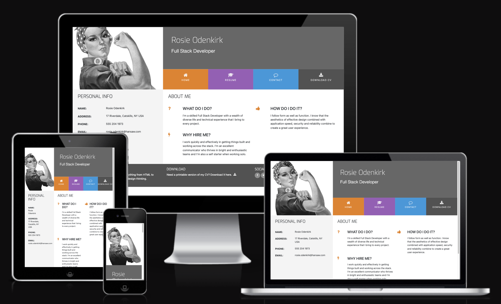
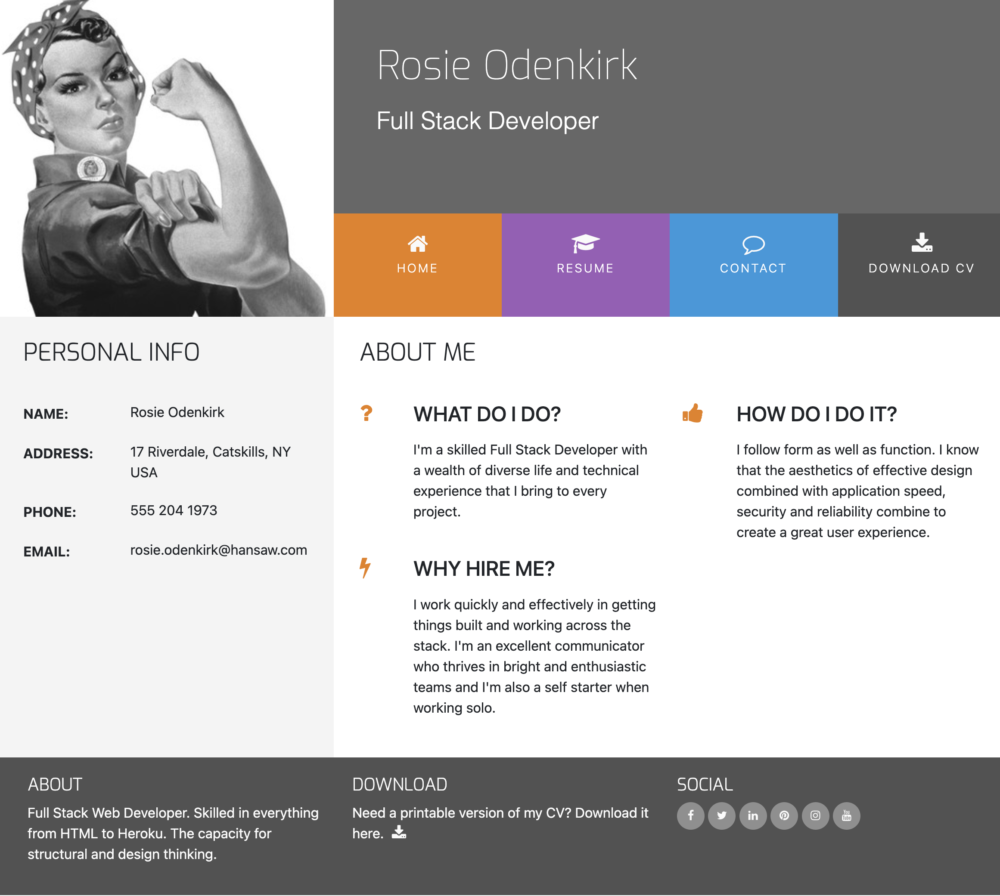
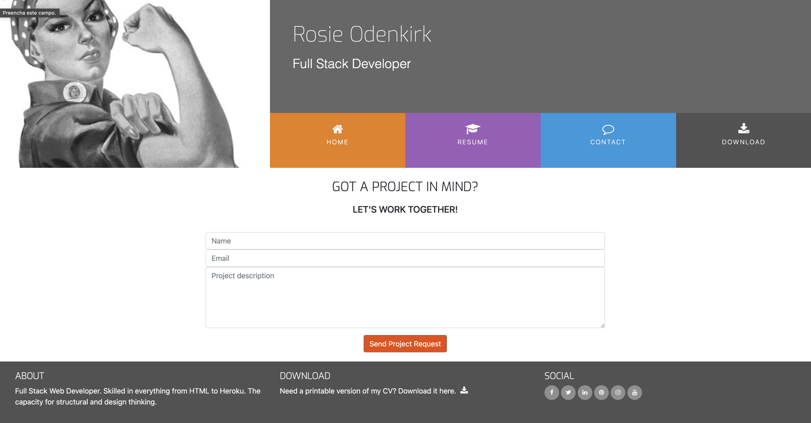

# Hello!

## This Resume page is an exercise to optimize my practice in bottstrap and front end. 
Here I've created a CV for a "PERSONA" with: 
- Index Page
- Resume Page
- Contact page
- Download page

## Header
The Header is made up of a photo of the "PERSONA",the name, the title and a menu with 4 links. 

## Main
### Index page:
On the index page, you can find PERSONA's personal information and About me information 

### Resume page:
On the Resume page, you'll find the main skills and a bar chart with the skill percentages. 

### Contact page:
The contact page contains a basic contact form where the person enters their details (Name and Email) and an area to enter a description of the project, followed by a button to send a message. 

### Download page:
In the menu there is a download link that opens in a new tab and rosie's cv appears. 

## Footer:
The footer contains a short text about the "PERSONA", a link to download the cv in pdf and links to the social networks. 
